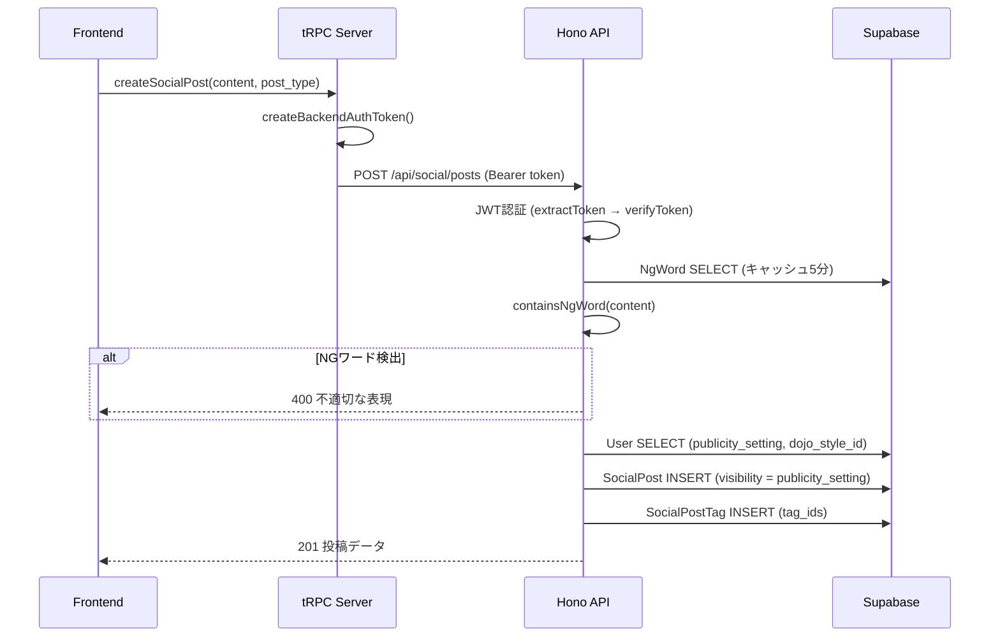
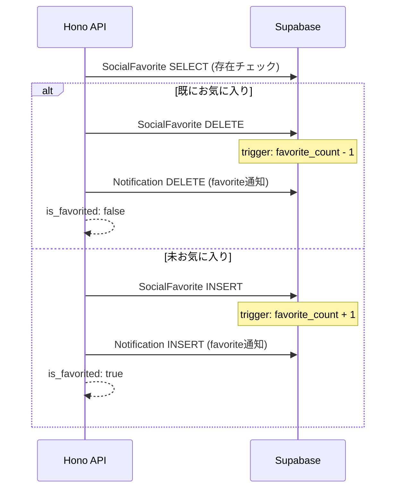
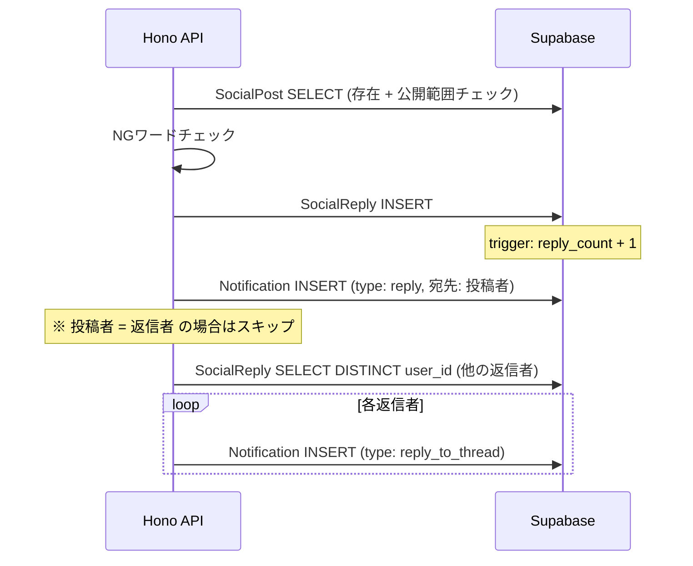

# ソーシャル投稿機能 バックエンド仕様書

「みんなで」タブで提供するソーシャル投稿機能のバックエンド実装仕様。
投稿・返信・お気に入り・通知・検索・通報・NGワードフィルタを包括する。

---

## 📋 システム概要

```
┌─────────────┐     tRPC      ┌──────────────┐    fetch     ┌──────────────┐
│  Frontend   │ ─────────────→ │  Next.js     │ ──────────→ │  Hono API    │
│  (Browser)  │ ← ─────────── │  tRPC Server │ ← ──────── │  (Backend)   │
└─────────────┘               └──────────────┘             └──────┬───────┘
                                                                  │
                                                          SERVICE_ROLE_KEY
                                                           (RLSバイパス)
                                                                  │
                                                           ┌──────▼───────┐
                                                           │  Supabase    │
                                                           │  PostgreSQL  │
                                                           └──────────────┘
```

### 認証フロー

全ソーシャルAPIエンドポイントは **JWT認証必須**。

1. フロントエンド tRPC プロシージャが `createBackendAuthToken()` でJWTを生成
2. `Authorization: Bearer <token>` ヘッダー付きで Hono API を呼び出し
3. 各ルートで `extractTokenFromHeader()` → `verifyToken()` を実行
4. `payload.userId` で本人確認、所有者チェックを実施

---

## 🗃️ データベーススキーマ

### テーブル一覧

| テーブル | 用途 | RLS |
|---|---|---|
| `SocialPost` | 投稿本体 | ✅ |
| `SocialPostAttachment` | 投稿添付ファイル | ✅ |
| `SocialPostTag` | 投稿タグ（M:N結合） | ✅ |
| `SocialReply` | 返信 | ✅ |
| `SocialFavorite` | お気に入り | ✅ |
| `Notification` | 通知 | ✅ |
| `PostReport` | 通報 | ✅ |
| `NgWord` | NGワードマスタ | ✅ |

### ER図

```
User (既存)
 ├── 1:N ── SocialPost
 │            ├── 1:N ── SocialPostAttachment
 │            ├── M:N ── UserTag (via SocialPostTag)
 │            ├── 1:N ── SocialReply ── User
 │            └── 1:N ── SocialFavorite ── User
 ├── 1:N ── Notification (recipient / actor)
 └── 1:N ── PostReport (reporter)
```

### SocialPost（投稿本体）

| カラム | 型 | 説明 |
|---|---|---|
| `id` | UUID PK | |
| `user_id` | UUID FK→User | 投稿者 |
| `content` | TEXT (≤2000) | 投稿内容 |
| `post_type` | TEXT | `'post'` or `'training_record'` |
| `visibility` | TEXT | `'public'` / `'closed'` / `'private'` |
| `author_dojo_style_id` | UUID FK→DojoStyleMaster NULL | 投稿時点のスナップショット |
| `author_dojo_name` | TEXT NULL | 投稿時点のスナップショット |
| `favorite_count` | INT DEFAULT 0 | トリガーで自動更新 |
| `reply_count` | INT DEFAULT 0 | トリガーで自動更新 |
| `is_deleted` | BOOL DEFAULT false | 論理削除フラグ |
| `source_page_id` | UUID FK→TrainingPage NULL | 稽古ノートから共有時の参照元 |
| `created_at` | TIMESTAMPTZ | |
| `updated_at` | TIMESTAMPTZ | |

**インデックス:**
- `idx_social_post_user_id(user_id)`
- `idx_social_post_feed(visibility, created_at DESC) WHERE is_deleted = false`
- `idx_social_post_source_page(source_page_id) WHERE source_page_id IS NOT NULL`

### SocialPostAttachment（添付ファイル）

`PageAttachment` と同構造。`page_id` → `post_id` に変更。

| カラム | 型 | 説明 |
|---|---|---|
| `id` | UUID PK | |
| `post_id` | UUID FK→SocialPost CASCADE | |
| `user_id` | UUID FK→User | |
| `type` | TEXT | `'image'` / `'video'` / `'youtube'` |
| `url` | TEXT | |
| `thumbnail_url` | TEXT NULL | |
| `original_filename` | TEXT NULL | |
| `file_size_bytes` | BIGINT NULL | |
| `sort_order` | INT DEFAULT 0 | |
| `created_at` | TIMESTAMPTZ | |

### SocialPostTag（投稿タグ M:N）

| カラム | 型 | 説明 |
|---|---|---|
| `id` | UUID PK | |
| `post_id` | UUID FK→SocialPost CASCADE | |
| `user_tag_id` | UUID FK→UserTag | |

`UNIQUE(post_id, user_tag_id)` 制約あり。

### SocialReply（返信）

| カラム | 型 | 説明 |
|---|---|---|
| `id` | UUID PK | |
| `post_id` | UUID FK→SocialPost CASCADE | |
| `user_id` | UUID FK→User | |
| `content` | TEXT (≤1000) | |
| `is_deleted` | BOOL DEFAULT false | |
| `created_at` | TIMESTAMPTZ | |
| `updated_at` | TIMESTAMPTZ | |

### SocialFavorite（お気に入り）

| カラム | 型 | 説明 |
|---|---|---|
| `id` | UUID PK | |
| `post_id` | UUID FK→SocialPost CASCADE | |
| `user_id` | UUID FK→User | |
| `created_at` | TIMESTAMPTZ | |

`UNIQUE(post_id, user_id)` 制約あり。

### Notification（通知）

| カラム | 型 | 説明 |
|---|---|---|
| `id` | UUID PK | |
| `type` | TEXT | `'favorite'` / `'reply'` / `'reply_to_thread'` |
| `recipient_user_id` | UUID FK→User | 通知の受信者 |
| `actor_user_id` | UUID FK→User | アクション実行者 |
| `post_id` | UUID FK→SocialPost NULL | |
| `reply_id` | UUID FK→SocialReply NULL | |
| `is_read` | BOOL DEFAULT false | |
| `created_at` | TIMESTAMPTZ | |

### PostReport（通報）

| カラム | 型 | 説明 |
|---|---|---|
| `id` | UUID PK | |
| `reporter_user_id` | UUID FK→User | |
| `post_id` | UUID FK→SocialPost NULL | |
| `reply_id` | UUID FK→SocialReply NULL | |
| `reason` | TEXT | `'spam'` / `'harassment'` / `'inappropriate'` / `'other'` |
| `detail` | TEXT (≤500) NULL | |
| `status` | TEXT DEFAULT `'pending'` | `'pending'` / `'reviewed'` / `'resolved'` |
| `created_at` | TIMESTAMPTZ | |

**CHECK制約:** `post_id` と `reply_id` のどちらか一方のみ NOT NULL。

### NgWord（NGワードマスタ）

| カラム | 型 | 説明 |
|---|---|---|
| `id` | UUID PK | |
| `word` | TEXT UNIQUE | NGワード |
| `created_at` | TIMESTAMPTZ | |

---

## ⚡ PostgreSQL トリガー & 関数

### カウンター自動更新

アプリケーション層でカウントを手動更新する代わりに、**PostgreSQLトリガー**で原子性を保証する。

#### `favorite_count` トリガー

```
SocialFavorite INSERT → SocialPost.favorite_count + 1
SocialFavorite DELETE → SocialPost.favorite_count - 1 (最小0)
```

#### `reply_count` トリガー

```
SocialReply INSERT (is_deleted=false) → SocialPost.reply_count + 1
SocialReply DELETE (is_deleted=false) → SocialPost.reply_count - 1
SocialReply UPDATE is_deleted: false→true  → reply_count - 1
SocialReply UPDATE is_deleted: true→false  → reply_count + 1
```

### フィードスコア関数 `get_social_feed()`

フィードの並び順を決定するPostgreSQL関数。`.rpc("get_social_feed")` で呼び出す。

**パラメータ:**

| 名前 | 型 | 説明 |
|---|---|---|
| `viewer_user_id` | UUID | 閲覧者のユーザーID |
| `viewer_dojo_style_id` | UUID | 閲覧者の道場流派ID |
| `tab_filter` | TEXT | `'all'` / `'training'` / `'favorites'` |
| `feed_limit` | INT | 取得件数 |
| `feed_offset` | INT | オフセット |

**スコア計算式:**

```
feed_score = EPOCH(created_at) / 3600
           + favorite_count × 2
           + reply_count × 3
           + 時間ボーナス
```

| 条件 | ボーナス |
|---|---|
| 24時間以内の投稿 | +50 |
| 72時間以内の投稿 | +20 |
| それ以外 | 0 |

**タブフィルタ:**

| タブ | 条件 |
|---|---|
| `all` | 全投稿 |
| `training` | `post_type = 'training_record'` のみ |
| `favorites` | 閲覧者がお気に入りした投稿のみ |

---

## 🔐 公開範囲（Visibility）制御

投稿作成時、`User.publicity_setting` の値を `SocialPost.visibility` にスナップショットとして保存する。

| visibility | 閲覧可能な対象 |
|---|---|
| `public` | 全認証ユーザー |
| `closed` | 同じ `dojo_style_id` のユーザー + 投稿者本人 |
| `private` | 投稿者本人のみ |

**チェック箇所:**
- フィード取得: `get_social_feed()` 関数内（SQL層）
- 投稿詳細: ルートハンドラ内（アプリケーション層）
- 返信作成: 投稿の公開範囲を確認後に許可
- 検索結果: アプリケーション層でフィルタ
- プロフィール: アプリケーション層でフィルタ

### favorite_count の公開範囲

**投稿者本人のみ** `favorite_count` を返却する。
他のユーザーには `undefined` を返す。

```typescript
favorite_count: post.user_id === viewerId ? post.favorite_count : undefined
```

---

## 🛡️ NGワードフィルタ

### 実装ファイル

`backend/src/lib/ng-word.ts`

### 仕組み

1. **`loadNgWords(supabase)`** — `NgWord` テーブルから全件取得、5分間インメモリキャッシュ
2. **`normalizeText(text)`** — テキスト正規化
   - 全角英数 → 半角
   - カタカナ → ひらがな
   - 大文字 → 小文字
3. **`containsNgWord(text, supabase)`** — 正規化後の部分一致チェック

### チェック対象

| 操作 | チェック対象 |
|---|---|
| 投稿作成 | `content` |
| 投稿更新 | `content`（変更時のみ） |
| 返信作成 | `content` |

### レスポンス

NGワード検出時は **400** を返す。具体的にどのワードがマッチしたかは返さない（セキュリティ配慮）。

```json
{
  "success": false,
  "error": "不適切な表現が含まれています。内容を修正してください。"
}
```

---

## 🔔 通知システム

### 通知タイプ

| type | トリガー | 受信者 |
|---|---|---|
| `favorite` | お気に入り追加 | 投稿者 |
| `reply` | 返信作成 | 投稿者 |
| `reply_to_thread` | 返信作成 | 同じ投稿に返信済みの他ユーザー |

### ルール

- **自分自身への通知はスキップ**: `recipient === actor` の場合は通知を作成しない
- **お気に入り解除時**: 対応する `favorite` 通知を削除
- **通知一覧**: `actor` のユーザー情報（username, profile_image_url）をJOIN
- **投稿プレビュー**: 投稿内容の先頭50文字を付加

### 既読化

```
PATCH /api/social/notifications/read
```

| パラメータ | 説明 |
|---|---|
| `notification_ids[]` | 指定IDのみ既読化 |
| `mark_all: true` | 全通知を既読化 |

---

## 🚨 通報システム

### エンドポイント

| パス | 対象 |
|---|---|
| `POST /api/social/reports/posts/:id` | 投稿通報 |
| `POST /api/social/reports/replies/:id` | 返信通報 |

### フロー

1. JWT認証チェック
2. **重複チェック**: 同じユーザーが同じ投稿/返信を再通報 → **409** 返却
3. `PostReport` テーブルに `status: 'pending'` で INSERT

### 通報理由

| reason | 説明 |
|---|---|
| `spam` | スパム |
| `harassment` | ハラスメント |
| `inappropriate` | 不適切なコンテンツ |
| `other` | その他（`detail` で補足可、500文字以内） |

---

## 🚀 APIエンドポイント一覧

全エンドポイントで `Authorization: Bearer <token>` ヘッダー必須。

### 投稿（`/api/social/posts`）

| メソッド | パス | 説明 | 主な処理 |
|---|---|---|---|
| GET | `/` | フィード取得 | `get_social_feed` RPC → 投稿者情報/添付/タグ/is_favorited を付加 |
| POST | `/` | 投稿作成 | NGワードチェック → User.publicity_setting → visibility スナップショット → INSERT |
| GET | `/:id` | 投稿詳細 | 公開範囲チェック → 返信一覧 + 添付 + タグ + 投稿者情報 |
| PUT | `/:id` | 投稿更新 | 所有者チェック + NGワードチェック → content/タグ更新 |
| DELETE | `/:id` | 論理削除 | 所有者チェック → `is_deleted = true` |
| POST | `/:id/replies` | 返信作成 | 公開範囲チェック + NGワードチェック → INSERT → 通知作成 |

#### GET `/` クエリパラメータ

| パラメータ | 型 | デフォルト | 説明 |
|---|---|---|---|
| `user_id` | string | 必須 | 閲覧者ID |
| `tab` | string | `'all'` | `'all'` / `'training'` / `'favorites'` |
| `limit` | string→int | `20` | 1〜100 |
| `offset` | string→int | `0` | 0〜 |

#### POST `/` リクエストボディ

```json
{
  "user_id": "UUID",
  "content": "投稿内容（1〜2000文字）",
  "post_type": "post | training_record",
  "source_page_id": "UUID (optional)",
  "tag_ids": ["UUID", "UUID"] // optional
}
```

### お気に入り（`/api/social/favorites`）

| メソッド | パス | 説明 |
|---|---|---|
| POST | `/:postId` | トグル（追加 or 解除） |

**レスポンス:**

```json
{
  "success": true,
  "data": {
    "is_favorited": true,
    "favorite_count": 5  // 投稿者本人のみ
  }
}
```

### 通報（`/api/social/reports`）

| メソッド | パス | 説明 |
|---|---|---|
| POST | `/posts/:id` | 投稿通報 |
| POST | `/replies/:id` | 返信通報 |

### 検索（`/api/social/search`）

| メソッド | パス | 説明 |
|---|---|---|
| GET | `/` | 投稿検索 |

#### クエリパラメータ

| パラメータ | 型 | 説明 |
|---|---|---|
| `user_id` | string | 必須（閲覧者ID） |
| `query` | string | キーワード（content ILIKE） |
| `dojo_name` | string | 道場名（author_dojo_name ILIKE） |
| `rank` | string | 段位（User.aikido_rank 完全一致） |
| `limit` | string→int | デフォルト20 |
| `offset` | string→int | デフォルト0 |

### 通知（`/api/social/notifications`）

| メソッド | パス | 説明 |
|---|---|---|
| GET | `/` | 通知一覧（recipient_user_id = JWT userId） |
| PATCH | `/read` | 既読化 |

### プロフィール（`/api/social/profile`）

| メソッド | パス | 説明 |
|---|---|---|
| GET | `/:userId` | User情報 + 公開投稿一覧 + 本人のみ累計お気に入り数 |

**レスポンス:**

```json
{
  "success": true,
  "data": {
    "user": {
      "id": "UUID",
      "username": "string",
      "profile_image_url": "string | null",
      "bio": "string | null",
      "aikido_rank": "string | null",
      "dojo_style_name": "string | null"
    },
    "posts": [...],
    "total_favorites": 42  // 本人のみ
  }
}
```

---

## 🏗️ 実装ファイル一覧

### バックエンド

| ファイル | 役割 |
|---|---|
| `src/migrations/002_create_social_tables.sql` | テーブル/トリガー/関数定義 |
| `src/migrations/003_enable_rls_social_tables.sql` | RLSポリシー定義 |
| `src/lib/ng-word.ts` | NGワードチェック（キャッシュ付き） |
| `src/lib/validation.ts` | Zodバリデーションスキーマ（ソーシャル部分追記） |
| `src/lib/supabase.ts` | DB型定義 + ヘルパー関数（ソーシャル部分追記） |
| `src/routes/social-posts/index.ts` | 投稿CRUD + 返信（6エンドポイント） |
| `src/routes/social-favorites/index.ts` | お気に入りトグル |
| `src/routes/social-reports/index.ts` | 投稿/返信通報 |
| `src/routes/social-search/index.ts` | 投稿検索 |
| `src/routes/social-notifications/index.ts` | 通知一覧 + 既読化 |
| `src/routes/social-profile/index.ts` | ソーシャルプロフィール |
| `src/app.ts` | ルート登録（6ルート追加） |

### フロントエンド（tRPC + APIクライアント）

| ファイル | 役割 |
|---|---|
| `src/server/trpc/procedures.ts` | 13プロシージャ追加 |
| `src/server/trpc/router.ts` | 5サブルーター追加 |
| `src/lib/api/client.ts` | 11のAPI関数 + キャッシュTTL追加 |

---

## 🔄 データフロー図

### 投稿作成フロー



### お気に入りトグルフロー



### 返信作成 → 通知フロー



---

## 📊 バリデーションスキーマ一覧

`backend/src/lib/validation.ts` に定義。

| スキーマ名 | 用途 | 主なルール |
|---|---|---|
| `createSocialPostSchema` | 投稿作成 | content: 1〜2000文字、post_type: enum |
| `updateSocialPostSchema` | 投稿更新 | content: optional 1〜2000文字 |
| `getSocialPostsSchema` | フィード取得 | tab: enum、limit/offset: string→int変換 |
| `createSocialReplySchema` | 返信作成 | content: 1〜1000文字 |
| `createReportSchema` | 通報 | reason: enum、detail: ≤500文字 |
| `searchSocialPostsSchema` | 検索 | query/dojo_name/rank: optional |
| `getNotificationsSchema` | 通知取得 | limit/offset: string→int変換 |
| `markNotificationsReadSchema` | 通知既読 | notification_ids[] or mark_all |

---

## 🔑 設計判断

| 項目 | 判断 | 理由 |
|---|---|---|
| カウンター更新 | PostgreSQLトリガー | アプリケーション層より原子性が高い |
| フィードソート | PostgreSQL関数 | SQL側でスコア計算+LIMIT/OFFSETが効率的 |
| NGワードキャッシュ | インメモリ5分TTL | Workers コールドスタート時に1回DB読み込み |
| `favorite_count` 公開範囲 | 投稿者本人のみ | プライバシー配慮 |
| `visibility` スナップショット | 投稿時にUser設定をコピー | 後から設定変更しても既存投稿に影響しない |
| 論理削除 | `is_deleted` フラグ | 通報対応時にコンテンツを確認できるよう保持 |
| 通知の自己スキップ | `recipient === actor` で除外 | 自分の投稿に自分でお気に入りしても通知不要 |
