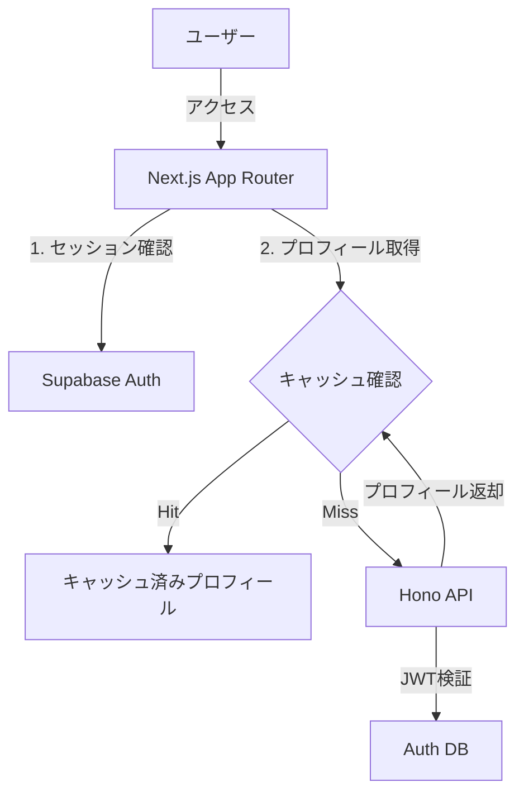

# ログイン・認証フロー仕様書

AikiNoteにおけるユーザー認証・ログインシステムの完全ガイド

## 📋 システム概要

### アーキテクチャ


### 使用技術
- **フロントエンド認証**: Supabase Auth (@supabase/ssr)
- **サーバーサイドキャッシュ**: Next.js `unstable_cache` (Data Cache)
- **認証データベース**: Supabase Auth Schema
- **ユーザーデータ**: Supabase Public Schema (`User`テーブル)
- **API認証**: JWT (JSON Web Token)
- **バックエンド**: Hono + JWT検証

---

## 🚀 パフォーマンス最適化（認証スキップ）

ユーザー体験の向上とバックエンド負荷軽減のため、ログイン済みユーザーのプロフィール情報取得において**サーバーサイドキャッシュ**を導入しています。これにより、頻繁なバックエンド API コールを抑制し、高速なページ表示を実現しています。

### 仕組み（Server-Side Caching）

Next.js の Data Cache 機能（`unstable_cache`）を利用し、外部 API (Hono) から取得したユーザー情報をキャッシュしています。

- **キャッシュキー**: `user-profile-${userId}`
- **TTL (有効期限)**: 1週間 (604,800秒)
- **ファイル**: `frontend/src/lib/server/cache.ts`

### データの整合性（Cache Invalidation）

キャッシュ期間が長いため、ユーザー情報が変更された場合は即座にキャッシュを破棄（Revalidate）する仕組みを実装しています。

| トリガー | API エンドポイント | 処理内容 |
|---|---|---|
| **プロフィール編集** | `PUT /api/user/[userId]` | 名前や道場名の変更完了後にキャッシュを無効化 |
| **アイコン画像設定** | `POST /api/profile-image` | S3へのアップロード完了後にキャッシュを無効化 |
| **アイコン削除** | `DELETE /api/profile-image` | S3からの削除完了後にキャッシュを無効化 |

実装コード例（更新時）:
```typescript
// プロフィール更新処理
const { data, error } = await updateUser(userData);
if (!error) {
  // キャッシュタグを指定して無効化
  revalidateUserProfile(userId); 
}
```

---

## 🔐 認証システムの構成

### Supabase Auth設定
- **プロバイダー**: Email/Password + Google OAuth
- **JWT Secret**: 環境変数で管理
- **セッション**: ブラウザのHTTPOnly Cookie

### データベース構造
```sql
-- Supabase Auth Schema (自動管理)
auth.users
├── id (UUID)
├── email
└── ...

-- Public Schema (手動管理, Hono経由でアクセス)
public.User
├── id (UUID)
├── email
├── username
├── profile_image_url
├── dojo_style_name
└── created_at
```

---

## 🔄 ログインフロー

### 1. ログインページアクセス
**場所**: `app/login/page.tsx`
既にログイン済みの場合はマイページへリダイレクトされます。

### 2. 認証処理 (Supabase)
Supabase Auth API を叩き、アクセストークンとリフレッシュトークンを取得します。これらは `cookie` に安全に保存されます。

### 3. プロフィール取得（最適化済み）
**場所**: `lib/server/auth.ts` -> `getCurrentUser()`

認証済みユーザーの情報を取得する際、以下のステップを踏みます。

1. **Supabase セッション確認**: Cookie からセッションを取得。
2. **キャッシュ確認**: `unstable_cache` を参照し、当該ユーザーのプロフィールデータが残っているか確認。
3. **データ取得**:
   - **キャッシュあり**: Web API を叩かずに即座にデータを返却（高速）。
   - **キャッシュなし**: Hono API (`/api/users/:id`) を叩いてデータを取得し、キャッシュに保存。

```typescript
// frontend/src/lib/server/auth.ts
export async function getCurrentUser(): Promise<UserSession | null> {
  const supabase = await getServerSupabase();
  const { data: { session } } = await supabase.auth.getSession();

  if (!session?.user) return null;

  // キャッシュを利用してプロフィール取得 (ここが最適化ポイント)
  return await getCachedUserProfile(session.user.id, session);
}
```

---

## 🚪 Google OAuth ログインフロー

### 1. 認証リクエスト
`supabase.auth.signInWithOAuth` を呼び出し、Google の認証画面へリダイレクトします。

### 2. コールバック処理
**場所**: `app/auth/callback/route.ts`
Google からの戻り（Code）を受け取り、Supabase のセッション（Cookie）に変換します。その後マイページへリダイレクトします。

---

## 🛡️ セキュリティ仕様

### セッション管理 (Supabase Auth)
- **アクセストークン有効期限**: 1時間（Supabaseのデフォルトセキュリティ設定）
  - ※ このトークンが切れても、裏側で自動的にリフレッシュされるため、ユーザーはログイン状態を維持できます。
  - ※ **Server-Side Cache (1週間)** とは別物です。こちらは「プロフィールデータの表示用キャッシュ」であり、認証トークンは「IDカードの有効期限」のようなものです。
- **リフレッシュ**: Supabase SSR が自動的にリフレッシュトークン (有効期限: 無期限/設定依存) を使って更新
- **保存場所**: HttpOnly Cookie（XSS対策）

### API認証 (Frontend ⇔ Backend)
Frontend から Backend (Hono) を呼び出す際は、Supabase のセッションから生成した JWT トークンを `Authorization: Bearer <token>` ヘッダーに付与します。

---

## ⏳ 認証初期化フロー（Client-Side）

サーバーサイドの認証とは別に、ブラウザ（Client）側でもページ読み込み時に「ログイン状態の復元」を行う必要があります。

### なぜ必要なのか？
SPA（Single Page Application）や Next.js のクライアントコンポーネントでは、ページリロード時に JavaScript のメモリ状態がリセットされます。そのため、以下の手順で再度「自分は誰か？」を確認する時間が発生します。

1. **ページロード**: ブラウザが JS を読み込む。
2. **初期化開始 (`isInitializing: true`)**: `useAuth` フックが Supabase (LocalStorage/Cookie) にセッション情報を問い合わせる。
3. **セッション復元**: 以前のログイン情報が見つかれば `user` ステートに格納。
4. **初期化完了 (`isInitializing: false`)**: ログイン済みか未ログインかが確定する。

### 実装上の注意点
この「初期化中」の数ミリ秒〜数秒間は、`user` が `null` (未ログイン扱い) になります。
そのため、**データ取得時は必ず `!isInitializing` (初期化完了) を待ってから**処理を開始しないと、「データなし（0件）」と誤判定されたり、ログイン画面へ飛ばされたりする不具合の原因になります。

```typescript
// 悪い例: 初期化中を考慮していない
const { user } = useAuth();
if (!user) return <Redirect to="/login" />; // 初期化中に勝手に飛ばされる！

// 良い例: 初期化完了を待つ
const { user, loading } = useAuth();
if (loading) return <Loader />; // 待機中
if (!user) return <Redirect to="/login" />; // 確定後に判定
```

---

## �️ 実装ファイル一覧

| パス | 説明 |
|---|---|
| `frontend/src/lib/server/auth.ts` | 認証ヘルパー関数 (`getCurrentUser` 等) |
| `frontend/src/lib/server/cache.ts` | **(New)** プロフィール情報のキャッシュ制御ロジック |
| `frontend/src/lib/supabase/client.ts` | クライアントサイド用 Supabase クライアント |
| `frontend/src/lib/supabase/server.ts` | サーバーサイド用 Supabase クライアント |
| `frontend/src/proxy.ts` | ルーティング保護ミドルウェア (旧 `middleware.ts`) |
| `frontend/src/app/api/user/[userId]/route.ts` | ユーザー情報更新 API (キャッシュ無効化を含む) |

---

## 🚨 トラブルシューティング

### プロフィールを更新したのに反映されない
**原因**: キャッシュの無効化（Revalidate）が失敗している可能性があります。
**確認**:
1. `revalidateUserProfile` が更新成功時に正しく呼ばれているか確認。
2. サーバーログでキャッシュタグ `user-profile-{userId}` のパージログを確認（Vercel Logs等）。

### "Failed to fetch RSC payload" エラー
ログアウト処理などで無限ループが発生している可能性があります。`useEffect` 内での `signOut` 呼び出しなどが適切に制御されているか確認してください。
