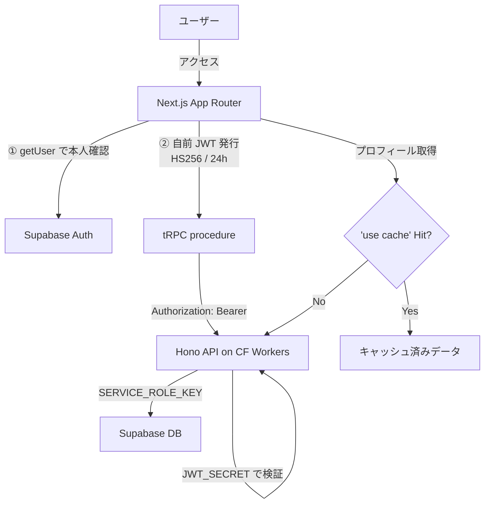
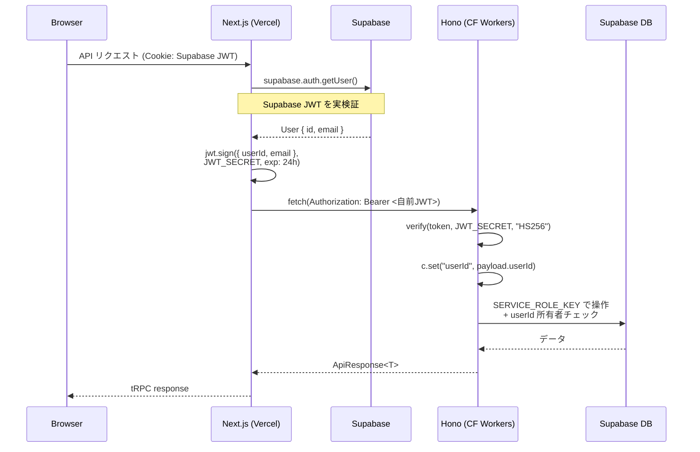

# ログイン・認証フロー仕様書

AikiNoteにおけるユーザー認証・ログインシステムの完全ガイド

## 📋 システム概要

### アーキテクチャ

```mermaid
graph TD
    User[ユーザー] -->|アクセス| NextJS[Next.js App Router]
    NextJS -->|① getUser で本人確認| Supabase[Supabase Auth]
    NextJS -->|② 自前 JWT 発行<br/>HS256 / 24h| BFF[tRPC procedure]
    BFF -->|Authorization: Bearer| Hono[Hono API on CF Workers]
    Hono -->|JWT_SECRET で検証| Hono
    Hono -->|SERVICE_ROLE_KEY| SupabaseDB[Supabase DB]
    NextJS -->|プロフィール取得| Cache{'use cache' Hit?}
    Cache -->|Yes| Cached[キャッシュ済みデータ]
    Cache -->|No| Hono
```

### 使用技術
- **フロントエンド認証**: Supabase Auth (@supabase/ssr)
- **サーバーサイドキャッシュ**: Next.js 16 Cache Components (`'use cache'` ディレクティブ + `cacheLife` / `cacheTag`)
- **認証データベース**: Supabase Auth Schema
- **ユーザーデータ**: Supabase Public Schema (`User`テーブル)
- **API認証**: **Next.js BFF が再発行する自前 JWT (HS256, 24h, payload: `{ userId, email }`)**
- **バックエンド**: Hono + JWT検証 (Cloudflare Workers)

---

## 🚀 パフォーマンス最適化（認証スキップ）

ユーザー体験の向上とバックエンド負荷軽減のため、ログイン済みユーザーのプロフィール情報取得において**サーバーサイドキャッシュ**を導入しています。これにより、頻繁なバックエンド API コールを抑制し、高速なページ表示を実現しています。

### 仕組み（Server-Side Caching）

Next.js 16 の **Cache Components**（`'use cache'` ディレクティブ + `cacheLife` + `cacheTag`）を利用し、外部 API (Hono) から取得したユーザー情報をキャッシュしています。

- **キャッシュタグ**: `user-info-${userId}`（`getUserInfoCacheTag()`）
- **TTL (有効期限)**: 1週間 (604,800秒)
- **ファイル**: `frontend/src/lib/server/cache.ts`

> **注**: 旧 `unstable_cache` から `'use cache'` ディレクティブに移行済み（コミット `ffd40ff`）。`next.config.js` の `cacheComponents: true` 設定下で Partial Pre-Rendering とタグベースの細粒度な無効化が両立できます。

### データの整合性（Cache Invalidation）

キャッシュ期間が長いため、ユーザー情報が変更された場合は即座にキャッシュを破棄（Revalidate）する仕組みを実装しています。

| トリガー | API エンドポイント | 処理内容 |
|---|---|---|
| **プロフィール編集** | `PUT /api/user/[userId]` | 名前や道場名の変更完了後にキャッシュを無効化 |
| **アイコン画像設定** | `POST /api/profile-image` | S3へのアップロード完了後にキャッシュを無効化 |
| **アイコン削除** | `DELETE /api/profile-image` | S3からの削除完了後にキャッシュを無効化 |

実装コード例（キャッシュ定義と更新時の無効化）:
```typescript
// frontend/src/lib/server/cache.ts
import { cacheLife, cacheTag, revalidateTag } from "next/cache";

async function getCachedUserInfoInner(userId: string, email: string) {
  "use cache";
  cacheLife({ revalidate: 604800 }); // 1 週間
  cacheTag(getUserInfoCacheTag(userId));
  return fetchUserInfoFromHono(userId, { id: userId, email } as User);
}

export const revalidateUserInfo = (userId: string) => {
  revalidateTag(getUserInfoCacheTag(userId), "max");
};

// プロフィール更新処理側
const { data, error } = await updateUser(userData);
if (!error) {
  revalidateUserInfo(userId); // タグベースで即時無効化
}
```

---

## 🔐 認証システムの構成

### Supabase Auth設定
- **プロバイダー**: Email/Password + Google OAuth + Apple OAuth
- **JWT Secret**: 環境変数で管理
- **セッション**: ブラウザの HttpOnly Cookie

### データベース構造
```sql
-- Supabase Auth Schema (自動管理)
auth.users
├── id (UUID)
├── email
└── ...

-- Public Schema (手動管理, Hono経由でアクセス)
public.User
├── id (UUID)
├── email
├── username
├── profile_image_url
├── dojo_style_name
├── dojo_style_id (UUID FK→DojoStyleMaster)
├── training_start_date
├── bio
├── aikido_rank
├── publicity_setting (public/closed/private)
├── language (ja/en)
├── is_email_verified
├── password_hash
├── verification_token
├── created_at
└── updated_at
```

---

## 🔄 ログインフロー

### 1. ログインページアクセス
**場所**: `app/[locale]/(public)/login/page.tsx`
既にログイン済みの場合はマイページへリダイレクトされます。

### 2. 認証処理 (Supabase)
Supabase Auth API を叩き、アクセストークンとリフレッシュトークンを取得します。これらは `HttpOnly` Cookie に安全に保存されます。

### 3. プロフィール取得（最適化済み）
**場所**: `lib/server/auth.ts` -> `getCurrentUser()`

認証済みユーザーの情報を取得する際、以下のステップを踏みます。

1. **Supabase ユーザー実検証**: `supabase.auth.getUser()` で Supabase サーバーに JWT 検証を問い合わせる。
2. **キャッシュ確認**: `'use cache'` ディレクティブ付きの `getCachedUserInfo()` を呼び、当該ユーザーのプロフィールデータがキャッシュ済みか確認。
3. **データ取得**:
   - **キャッシュあり**: Hono API を叩かずに即座にデータを返却（高速）。
   - **キャッシュなし**: 自前 JWT を発行して Hono API (`/api/users/:id`) を叩いてデータを取得し、キャッシュに保存。

```typescript
// frontend/src/lib/server/auth.ts
export async function getCurrentUser(): Promise<UserSession | null> {
  const supabase = await getServerSupabase();
  const {
    data: { user },
    error,
  } = await supabase.auth.getUser();

  if (error || !user) return null;

  // キャッシュを利用してプロフィール取得 (ここが最適化ポイント)
  return await getCachedUserInfo(user.id, user);
}
```

> **🛡️ セキュリティ補足**: 以前は `supabase.auth.getSession()` を使っていましたが、これは Cookie の値をそのまま信頼してしまうため、Cookie 改ざんによるなりすましのリスクがありました。現在は `getUser()` で毎回 Supabase に問い合わせて JWT を実検証する方式に変更しています（コミット `7dcedc0`）。RTT は増えますが、ユーザー情報自体は 1 週間キャッシュしているためレイテンシは相殺されます。

---

## 🚪 Google / Apple OAuth ログインフロー

### 1. 認証リクエスト
`supabase.auth.signInWithOAuth` を呼び出し、Google / Apple の認証画面へリダイレクトします。

- **アカウント選択強制**: `queryParams: { prompt: "select_account" }` を付与し、既存セッションでのサイレントログインを防止（複数アカウント所有時の事故防止）。

### 2. コールバック処理
**場所**: `app/auth/callback/route.ts`
Google / Apple からの戻り（Code）を受け取り、Supabase のセッション（Cookie）に変換します。returnTo cookie があればその URL へ、なければマイページへリダイレクトします。

---

## 🔁 認証後リダイレクト（returnTo）

未ログインユーザーが投稿詳細などの公開ページを閲覧中に、`SignupPromptModal` からログイン/サインアップした場合、認証完了後に**元のページへ自動的に戻す**仕組みです。

### 仕組み

`SignupPromptModal` でログイン/サインアップボタンをタップした時点で、現在の URL パスを **cookie** と **sessionStorage** の両方に保存します。

| 認証方式 | 保持手段 | リダイレクト実行場所 |
|---|---|---|
| メール/パスワード | sessionStorage | `useAuth.tsx`（クライアント） |
| Google / Apple OAuth | cookie (`auth_return_to`) | `auth/callback/route.ts`（サーバー） |

OAuth ではブラウザが外部の認証画面に遷移するため sessionStorage だけでは不十分です。cookie は同一ドメイン・同一タブで保持されるため、サーバーサイドの OAuth コールバックで読み取れます。

### ユーティリティ
**場所**: `lib/utils/returnTo.ts`

| 関数 | 用途 |
|---|---|
| `isValidReturnTo(path)` | パスのバリデーション（サーバー/クライアント両用） |
| `setReturnTo(path)` | cookie + sessionStorage に保存（クライアント） |
| `getReturnToFromSession()` | sessionStorage から取得＆クリア（クライアント） |
| `clearReturnToCookie()` | cookie クリア（クライアント） |

### セキュリティ: オープンリダイレクト防止

`isValidReturnTo()` で以下を拒否し、自サイト内の相対パスのみ許可します:

- `//evil.com`（プロトコル相対URL）
- `https://evil.com`（絶対URL）
- `javascript:alert(1)`（スキーム付きURL）
- 制御文字・バックスラッシュを含むパス

cookie 設定: `SameSite=Lax`、`max-age=600`（10分）、パスのみ保存（機密情報なし）

### エッジケース

| ケース | 動作 |
|---|---|
| cookie 期限切れ（10分超） | `/personal/pages` にフォールバック |
| 複数タブで別のページから認証開始 | 後勝ち（最後にセットした URL） |
| 通常のログインページから直接ログイン | returnTo 未設定のため `/personal/pages`（既存動作） |
| サインアップ → メール認証 → 別タブで開く | 現状のメール認証フローは `/auth/callback` を経由しないためフォールバック |

---

## 🛡️ セキュリティ仕様

### セッション管理 (Supabase Auth)
- **アクセストークン有効期限**: 1時間（Supabaseのデフォルトセキュリティ設定）
  - ※ このトークンが切れても、裏側で自動的にリフレッシュされるため、ユーザーはログイン状態を維持できます。
  - ※ **Server-Side Cache (1週間)** とは別物です。こちらは「プロフィールデータの表示用キャッシュ」であり、認証トークンは「IDカードの有効期限」のようなものです。
- **リフレッシュ**: Supabase SSR が自動的にリフレッシュトークン (有効期限: 無期限/設定依存) を使って更新
- **保存場所**: HttpOnly Cookie（XSS対策）

---

## 🔑 JWT 発行・検証フロー（Frontend ⇔ Backend）

### 設計思想

Frontend (Next.js) から Backend (Hono) を呼び出す際は、**Supabase が発行した JWT をそのまま転送するのではなく、Next.js BFF 層で自前の JWT を新規発行**して Hono に渡しています。

### シーケンス図


```mermaid
sequenceDiagram
    participant Browser
    participant NextJS as Next.js (Vercel)
    participant Supabase
    participant Hono as Hono (CF Workers)
    participant DB as Supabase DB

    Browser->>NextJS: API リクエスト (Cookie: Supabase JWT)
    NextJS->>Supabase: supabase.auth.getUser()
    Note over NextJS,Supabase: Supabase JWT を実検証
    Supabase-->>NextJS: User { id, email }
    NextJS->>NextJS: jwt.sign({ userId, email },<br/>JWT_SECRET, exp: 24h)
    NextJS->>Hono: fetch(Authorization: Bearer <自前JWT>)
    Hono->>Hono: verify(token, JWT_SECRET, "HS256")
    Hono->>Hono: c.set("userId", payload.userId)
    Hono->>DB: SERVICE_ROLE_KEY で操作<br/>+ userId 所有者チェック
    DB-->>Hono: データ
    Hono-->>NextJS: ApiResponse<T>
    NextJS-->>Browser: tRPC response
```

### 実装コード

**BFF 側** — `frontend/src/server/trpc/index.ts`:
```typescript
export const authenticatedProcedure = t.procedure.use(async ({ next }) => {
  const serverSupabase = await getServerSupabase();
  const {
    data: { user },
    error,
  } = await serverSupabase.auth.getUser();

  if (error || !user) {
    throw new TRPCError({ code: "UNAUTHORIZED", message: "認証が必要です" });
  }

  // Supabase JWT を中継するのではなく、最小ペイロードで自前 JWT を再発行
  const authToken = jwt.sign(
    { userId: user.id, email: user.email ?? "" },
    JWT_SECRET,
    { expiresIn: "24h" },
  );
  return next({ ctx: { authToken } });
});
```

**Hono 側** — `backend/src/middleware/auth.ts`:
```typescript
export const authMiddleware = createMiddleware<Env>(async (c, next) => {
  try {
    const authHeader = c.req.header("Authorization");
    const token = extractTokenFromHeader(authHeader);
    const payload = await verifyToken(token, c.env); // hono/jwt の verify (HS256)

    c.set("userId", payload.userId);
    await next();
  } catch {
    return c.json({ success: false, error: "認証エラー" }, 401);
  }
});
```

### 設計意図

| 観点 | Supabase JWT 直接転送 | 自前 JWT 再発行（採用） |
|---|---|---|
| Hono の依存 | Supabase JWKS / 共有秘密鍵が必要 | **JWT_SECRET だけで完結** |
| Payload | Supabase の全 claim を持つ（role, app_metadata 等） | **`{ userId, email }` のみ最小** |
| 失効制御 | Supabase 任せ | AikiNote 側で完全制御（24h） |
| Edge 実行との相性 | JWKS 検証は重い | **HS256 検証は軽量** |
| 認証境界 | フロントとバックが密結合 | **境界が明確に切れる** |
| ネイティブ/外部統合 | Supabase JWT 構造を知る必要あり | **Hono 単独で独立した API** |

> Next.js 層で「ユーザー本人かどうか」を Supabase に確認した上で、Hono 層には「ユーザー ID と email だけ署名済みで渡す」という、用途別の責務分離を狙った設計です。これにより Hono は Supabase の存在を一切知らずに認証が成立します。

### Hono ↔ Supabase DB

Hono バックエンドは `SUPABASE_SERVICE_ROLE_KEY` で Supabase クライアントを初期化し、RLS をバイパスして DB を操作します。代わりに **アプリ層で `c.get("userId")` を使った所有者チェック** を必ず行います。

同時に、万一フロントエンドから直接 Supabase を叩かれた場合の保険として、RLS ポリシーも `auth.uid()` ベースで張る**二重ガード**を採用しています。

---

## ⏳ 認証初期化フロー（Client-Side）

サーバーサイドの認証とは別に、ブラウザ（Client）側でもページ読み込み時に「ログイン状態の復元」を行う必要があります。

### AuthProvider による Context 一元化

`useAuth` は `frontend/src/lib/hooks/useAuth.tsx` で **React Context Provider** として実装されており、認証状態は単一のインスタンスで保持されます。

> **🚀 改善経緯**: 以前は `useAuth()` を呼ぶ度に各コンポーネントが独立して `supabase.auth.getSession()` → `fetchUserProfile()` → `getUserInfo` API を走らせていました。authenticated ルートでは 30 以上の箇所で `useAuth` が呼ばれており、Cloudflare Workers / Supabase の順序待ちで本番では **最大 20 秒以上の遅延** が発生していました。AuthProvider に集約することで `getUserInfo` API は **画面ロード時 1 回のみ** に削減されました（コミット `4f19029`）。

### なぜ必要なのか？
SPA（Single Page Application）や Next.js のクライアントコンポーネントでは、ページリロード時に JavaScript のメモリ状態がリセットされます。そのため、以下の手順で再度「自分は誰か？」を確認する時間が発生します。

1. **ページロード**: ブラウザが JS を読み込む。
2. **初期化開始 (`isInitializing: true`)**: `AuthProvider` が Supabase (LocalStorage/Cookie) にセッション情報を問い合わせる。
3. **3 秒タイムアウト**: 不安定回線での無限ロードを防ぐため、`Promise.race` で `getSession()` に **3 秒タイムアウト** を被せ、タイムアウト時は未ログイン扱いで UI を先に出す。
4. **セッション復元**: 以前のログイン情報が見つかれば `user` ステートに格納。
5. **初期化完了 (`isInitializing: false`)**: ログイン済みか未ログインかが確定する。

```typescript
// frontend/src/lib/hooks/useAuth.tsx (抜粋)
const initializeSession = async () => {
  const sessionPromise = supabaseClient.auth.getSession();
  const timeoutPromise = new Promise<never>((_, reject) =>
    setTimeout(() => reject(new Error("getSession timeout")), 3000),
  );
  const result = await Promise.race([sessionPromise, timeoutPromise]);
  await applySession(result.data.session);
};
```

### 実装上の注意点
この「初期化中」の数ミリ秒〜数秒間は、`user` が `null` (未ログイン扱い) になります。
そのため、**データ取得時は必ず `!isInitializing` (初期化完了) を待ってから**処理を開始しないと、「データなし（0件）」と誤判定されたり、ログイン画面へ飛ばされたりする不具合の原因になります。

```typescript
// 悪い例: 初期化中を考慮していない
const { user } = useAuth();
if (!user) return <Redirect to="/login" />; // 初期化中に勝手に飛ばされる！

// 良い例: 初期化完了を待つ
const { user, loading } = useAuth();
if (loading) return <Loader />; // 待機中
if (!user) return <Redirect to="/login" />; // 確定後に判定
```

---

## 🗂️ 実装ファイル一覧

| パス | 説明 |
|---|---|
| `frontend/src/lib/server/auth.ts` | 認証ヘルパー (`getCurrentUser`, `createBackendAuthToken`, `fetchUserInfoFromHono`) |
| `frontend/src/lib/server/cache.ts` | プロフィール情報のキャッシュ制御 (`'use cache'` + `cacheLife` + `cacheTag` + `revalidateUserInfo`) |
| `frontend/src/lib/supabase/client.ts` | クライアントサイド用 Supabase クライアント |
| `frontend/src/lib/supabase/server.ts` | サーバーサイド用 Supabase クライアント |
| `frontend/src/lib/utils/returnTo.ts` | 認証後リダイレクト（returnTo）ユーティリティ |
| `frontend/src/lib/hooks/useAuth.tsx` | 認証フック / Context Provider（ログイン・ログアウト・OAuth・3 秒タイムアウト） |
| `frontend/src/server/trpc/index.ts` | tRPC `authenticatedProcedure` — `getUser()` 検証 + 自前 JWT 発行 |
| `frontend/src/app/auth/callback/route.ts` | OAuth コールバック（セッション交換 + returnTo リダイレクト） |
| `frontend/src/proxy.ts` | ルーティング保護ミドルウェア (旧 `middleware.ts`)。RSC リクエスト時は getSession スキップ |
| `frontend/src/app/api/user/[userId]/route.ts` | ユーザー情報更新 API (キャッシュ無効化を含む) |
| `backend/src/middleware/auth.ts` | Hono `authMiddleware` — Bearer トークン抽出 + JWT 検証 + `c.set("userId", ...)` |
| `backend/src/lib/jwt.ts` | JWT 発行・検証ユーティリティ (`generateToken` / `verifyToken`, HS256 / 24h) |

---

## 🚨 トラブルシューティング

### プロフィールを更新したのに反映されない
**原因**: キャッシュの無効化（Revalidate）が失敗している可能性があります。
**確認**:
1. `revalidateUserInfo(userId)` が更新成功時に正しく呼ばれているか確認。
2. サーバーログでキャッシュタグ `user-info-{userId}` のパージログを確認（Vercel Logs 等）。

### "Failed to fetch RSC payload" エラー
ログアウト処理などで無限ループが発生している可能性があります。`useEffect` 内での `signOut` 呼び出しなどが適切に制御されているか確認してください。

### Hono API から 401 認証エラーが返る
**原因**: 自前 JWT の検証失敗。
**確認**:
1. Frontend と Backend で `JWT_SECRET` が一致しているか確認。
2. 24 時間以上前に発行された JWT を使っていないか確認（自前 JWT の有効期限は `expiresIn: "24h"`）。
3. Authorization ヘッダの形式が `Bearer <token>` であること、tRPC の `authenticatedProcedure` を経由して発行されたトークンであることを確認。
